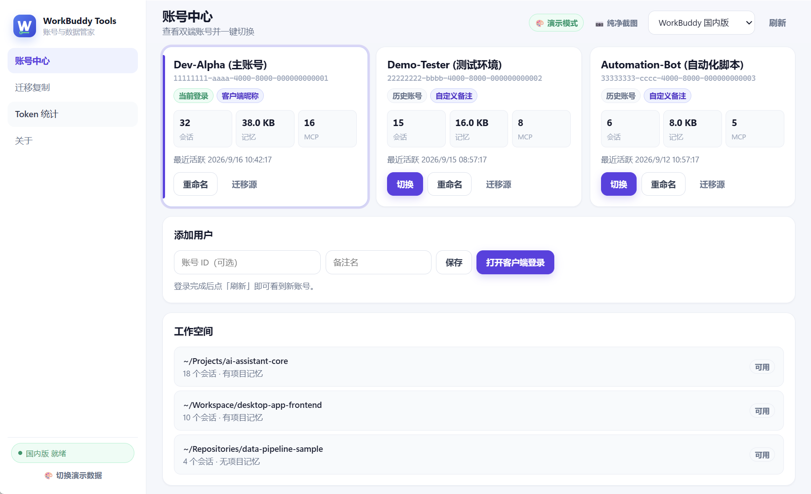
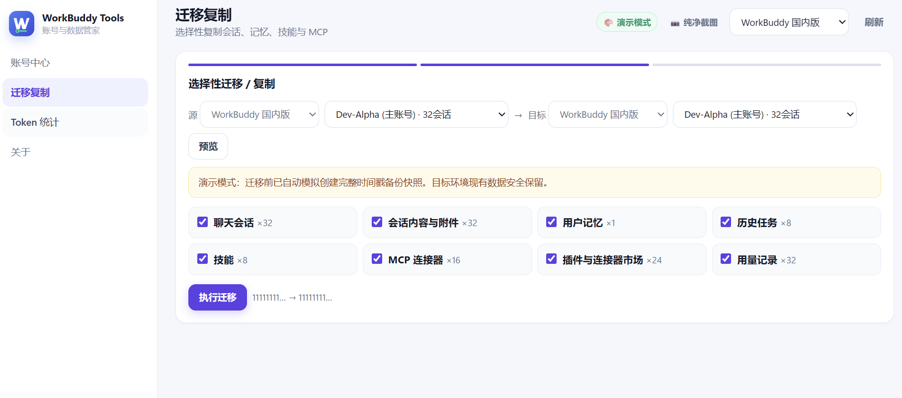
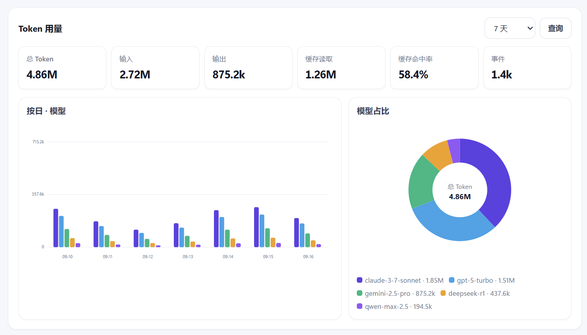

# WorkBuddy Tools

[English](README.en.md) · 简体中文

[](https://github.com/Harvey-Will/workbuddy-tools/releases)
[](https://github.com/Harvey-Will/workbuddy-tools/releases)
[](https://github.com/Harvey-Will/workbuddy-tools/stargazers)
[](https://github.com/Harvey-Will/workbuddy-tools/issues)
[](LICENSE)

## 在不同账号间，无缝衔接你的 WorkBuddy 工作

WorkBuddy Tools 是一款面向 **WorkBuddy / WorkBuddyAI** 的本地账号与数据管理工具。

如果你同时使用多个账号，或者经常在国内版与国际版之间切换，WorkBuddy Tools 可以帮你在一个桌面应用里完成账号管理、快速切换、数据迁移与 Token 用量查看，让不同账号之间的工作衔接更简单。

账号、会话、记忆和配置均基于本机数据处理。不需要项目自建云服务，也不会将你的 WorkBuddy 数据上传到第三方服务器。

**功能**：多账号管理 · 快速切换 · 数据迁移 · 会话与记忆 · Skills / MCP · Token 用量统计 · 本地优先

**平台**：Windows

---

## 功能概览

### 账号管理

自动识别本机的 WorkBuddy 与 WorkBuddyAI 数据，并将不同版本、不同账号统一展示。

- 查看账号名称、会话、Memory、MCP 与最近活跃时间
- 快速识别当前正在使用的账号
- 一键切换到其他本地账号
- 为账号添加自定义备注，方便多账号管理

不再需要反复寻找配置文件或手动修改本地数据。

> 

### 数据迁移

在不同账号或不同版本之间，按需迁移你真正需要的数据。

支持的数据包括：

- 聊天会话
- 会话内容与附件
- 用户记忆
- 历史任务
- Skills
- MCP 配置
- 插件与连接器数据
- Token 用量记录

迁移前可以先预览数据，再选择需要迁移的项目。目标账号已有的数据会尽可能保留，迁移前也会自动创建本地备份。

当前同版本账号之间暂不提供会话类数据迁移；Memory、MCP、Skills 等支持的数据仍可独立迁移。

> 

### Token 用量

直接从本地会话数据中整理 Token 使用情况。

- 时间范围：今天 / 24 小时 / 7 天 / 30 天 / 90 天
- Input / Output Token、Cache Read
- 按模型统计与用量占比

不用逐个打开会话，也能快速了解不同模型的实际使用情况。

> 

### 本地优先

核心操作全部围绕本地 WorkBuddy 数据完成。

- 不需要注册 WorkBuddy Tools 账号
- 不依赖项目自建云服务
- 账号扫描、迁移和 Token 统计均在本机完成
- 迁移前自动备份
- 客户端运行时会阻止可能产生冲突的迁移或切换操作

你的数据始终由你自己管理。

---

## 下载

推荐直接使用 Windows 便携版。

前往 [Releases](https://github.com/Harvey-Will/workbuddy-tools/releases) 下载最新的：

```text
WorkBuddyTools-portable-win64-*.zip
```

解压后运行 `workbuddy-tools.exe` 即可使用，无需安装 Python、Node.js 或 Rust。

---

## 快速开始

1. 启动 WorkBuddy Tools
2. 选择 WorkBuddy 或 WorkBuddyAI
3. 在账号中心查看本机账号
4. 根据需要切换账号，或进入迁移页面选择源账号和目标账号
5. 预览并选择需要迁移的数据
6. 在 Token 页面查看模型用量

进行数据迁移或账号切换前，请**完全退出**对应的 WorkBuddy / WorkBuddyAI 客户端。

---

## 安全与隐私

WorkBuddy Tools 是一个本地优先工具。

WorkBuddy 本地数据默认位于：

- `~/.workbuddy`
- `~/.workbuddy-ai`

WorkBuddy Tools 只在需要时读取或修改这些本地文件，并将自己的备份和辅助数据存放在对应的数据目录中。项目本身没有用于存储用户账号、会话或记忆数据的云端服务。

对于重要工作数据，仍建议保留自己的定期备份。

---

## 常见问题

**会把我的账号或会话上传到服务器吗？**

不会。账号扫描、数据迁移和 Token 统计均基于本地数据完成。

**可以在两个 WorkBuddy 账号之间迁移数据吗？**

可以。Memory、Skills、MCP 等数据可以根据当前支持范围进行选择性迁移。同版本账号之间的会话类数据目前暂不支持迁移。

**为什么切换账号后 WorkBuddy 里还是原来的账号？**

请完全退出 WorkBuddy，包括后台或托盘进程，再重新启动客户端。

**Token 统计是不是官方账单？**

不是。Token 页面统计的是本机会话数据中的 usage 信息，用于帮助你了解模型使用情况，可能与官方最终计费口径存在差异。

---

## 开发

### 环境

- Python 3.10+
- Node.js 18+
- Rust / Cargo（桌面构建）

### 本地开发

```bash
npm install
cd ui && npm install && cd ..
npm run dev:desktop
```

### 构建

```powershell
powershell -File scripts/build_sidecar.ps1
npm run build:portable
```

### 测试

```powershell
.venv\Scripts\python -m unittest discover -s tests
```

### 技术栈

Tauri 2 · TypeScript / Vite · Python · FastAPI · SQLite

---

## 贡献

欢迎提交 Issue、功能建议和 Pull Request。

如果 WorkBuddy Tools 对你有帮助，也欢迎点一个 ⭐ Star。

## License

MIT License

## Disclaimer

WorkBuddy Tools 是独立的社区工具，与 WorkBuddy / 腾讯不存在官方隶属或合作关系。

本工具会在用户授权操作下读取和修改本机 WorkBuddy 数据。对于重要数据，建议始终保留额外备份。
